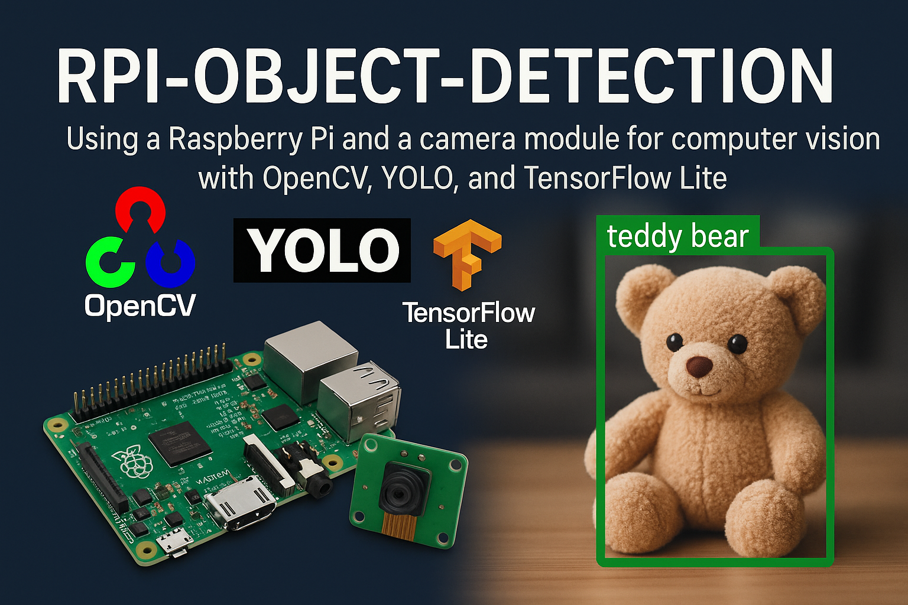
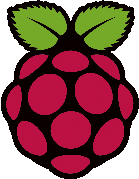
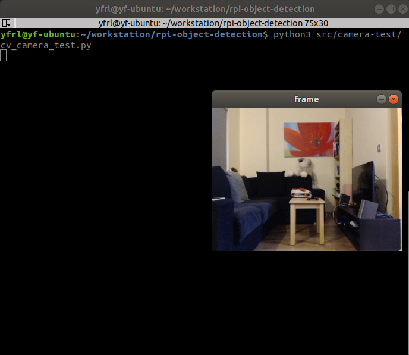
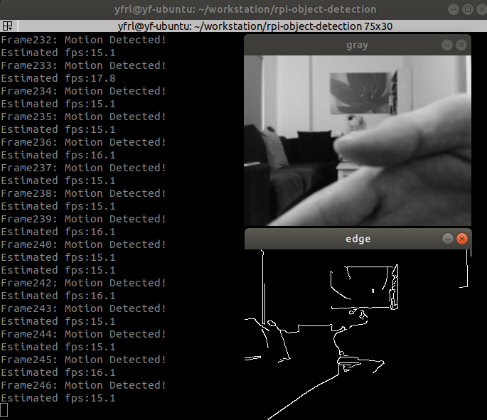
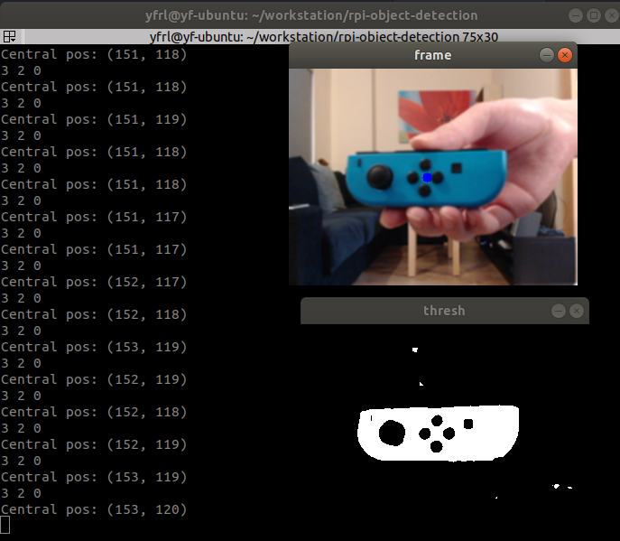
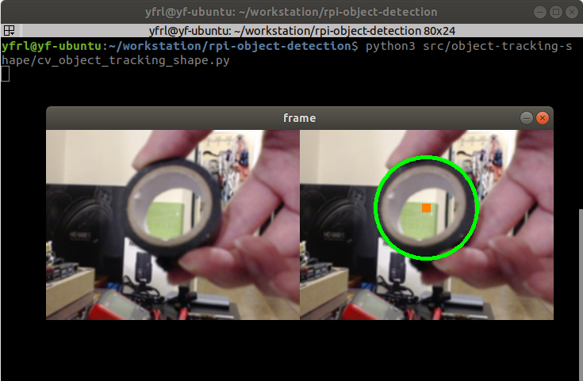
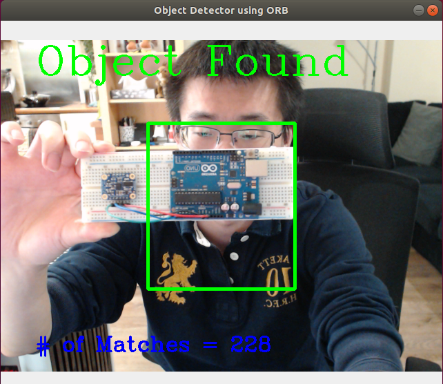
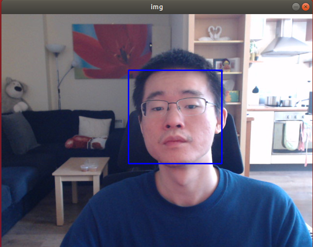

# Raspberry Pi Real-Time Object Detection and Tracking

  



- [Raspberry Pi Real-Time Object Detection and Tracking](#raspberry-pi-real-time-object-detection-and-tracking)
  * [1. Introduction](#1-introduction)
  * [2. Dependency](#2-dependency)
    + [2.1. Packages requirement](#21-packages-requirement)
    + [2.2. Hardware support](#22-hardware-support)
  * [3. What's in this repository](#3-what-s-in-this-repository)
    + [3.1. Camera Test](#31-camera-test)
    + [3.2. Motion Detection](#32-motion-detection)
    + [3.3. Color-based Object Detection and Tracking](#33-color-based-object-detection-and-tracking)
    + [3.4. Shape-based Object Detection and Tracking](#34-shape-based-object-detection-and-tracking)
    + [3.5. Feature-based Object Detection and Tracking (with ORB)](#35-feature-based-object-detection-and-tracking--with-orb-)
    + [3.6. Face Detection and Tracking](#36-face-detection-and-tracking)
    + [3.7. Object Detection using YOLO](#37-object-detection-using-yolo)
    + [3.8. Object Detection using TensorFlow Lite](#38-object-detection-using-neural-network-tensorflow-lite)
  * [4. How to Run](#4-how-to-run)
    + [4.1. Install the environment](#41-install-the-environment)
    + [4.2. Run the scripts](#42-run-the-scripts)
    + [4.3. Change camera resolution](#43-change-camera-resolution)
  * [5. Q&A](#5-q-a)
  * [License](#license)

<small><i><a href='http://ecotrust-canada.github.io/markdown-toc/'>Table of contents generated with markdown-toc</a></i></small>




## 1. Introduction
Using a Raspberry Pi and a camera module for computer vision with OpenCV, YOLO, and TensorFlow Lite. The aim of this project is to provide a starting point for using RPi & CV in your own DIY / maker projects. Computer vision based on cameras is very powerful and will bring your project to the next level. This allows you to track complicated objects that would otherwise not be possible with other types of sensors (infrared, ultrasonic, LiDAR, etc).

Note the code is based on Python and OpenCV meaning it is cross-platform. You can run this on other Linux-based platforms as well, e.g. x86/x64 PC, IPC, Jetson, Banana Pi, LattaPanda, BeagleBoard, etc.


## 2. Dependency
### 2.1. Packages requirement
This project is dependent on the following packages:
- Python >= 3.6.9
- OpenCV-Python
- OpenCV-Contrib-Python
- NumPy
- SciPy
- Matplotlib
- Ultralytics

### 2.2. Hardware support
- Support Raspberry Pi 1 Model B, Raspberry Pi 2, Raspberry Pi Zero, and Raspberry Pi 3/4/5 (preferable)
  - Different boards will have very varied performances.
  - RPi 3/4/5 are preferable as they have more powerful CPUs;
  - RPi 1/2 may be struggling and produce very low FPS, in which case you can further reduce the camera resolution (160 x 120).
- Nvidia Jetson
  - Jetson Nano (A01) also passed the test.
  - Jetson Orin Nano should work as well.
  - Jetson has its own repo now: [jetson-object-detection](https://github.com/automaticdai/jetson-object-detection)
- Any USB camera supported by Raspberry Pi
  - To see a list of all supportive cameras, visit http://elinux.org/RPi_USB_Webcams
- The official RPi camera module is supported through `Picamera2`.


## 3. What's in this repository
Currently, the following applications are implemented:

- `src/camera-test`: Test if the camera is working
- `src/motion-detection`: Detect any motion in the frame
- `src/object-tracking-color`: Object detection & tracking based on color
- `src/object-tracking-shape`: Object detection & tracking based on shape
- `src/object-tracking-feature`: Object detection & tracking based on features using ORB
- `src/face-detection`: Face detection & tracking
- `src/object-detection-yolo`: Object detection using YOLO (RPi 3/4/5 only)
- `src/object-detection-tflite`: Object detection using TensorFlow Lite (RPi 3/4/5 only)


### 3.1. Camera Test
Test the RPi and OpenCV environment. You are expected to see a pop-up window that has video streams from your USB camera if everything is set up correctly. If the window does not appear, you need to check both of (1) your environment; (2) camera connection.



### 3.2. Motion Detection
Detect object movements in the camera frame and print a warning message when motion is sustained.

Pipeline: the current and previous frames are converted to grayscale, Gaussian-blurred to suppress sensor noise, then compared with a per-pixel `cv2.absdiff`. The resulting diff is thresholded, dilated, and passed through `cv2.findContours`; only connected regions with area ≥ `MIN_MOTION_AREA` count as motion, and a debounce (`MOTION_CONSECUTIVE_FRAMES`) rejects one-frame transients. All thresholds are constants at the top of the script, so you can trade sensitivity for false-positive rate without touching the loop.



### 3.3. Color-based Object Detection and Tracking
Track an object based on its color in HSV and print its center position. You can choose your own color by clicking on the object of interest. Click multiple times on different points so a full color space is covered. You can hard code the parameters so you don't need to pick them again for the next run. The following demo shows how I track a Nintendo game controller in real-time:



### 3.4. Shape-based Object Detection and Tracking
Detect and track geometric shapes in the frame:

- **Circles** via `cv2.HoughCircles()`
- **Triangles** and **rectangles** via contour approximation (`cv2.findContours()` + `cv2.approxPolyDP()`)

Contours below `MIN_CONTOUR_AREA` pixels are filtered out to reduce noise; the epsilon used for polygon approximation and the Canny edge thresholds are configurable at the top of the script.



### 3.5. Feature-based Object Detection and Tracking (with ORB)
Detect and track an object using its feature. The algorithm I selected here is ORB (Oriented FAST and Rotated BRIEF) for its fast calculation speed to enable real-time detection. To use the example, please prepare an Arduino UNO board in hand (or replace the `simple.png`).



### 3.6. Face Detection and Tracking
Detecting face using Harr Cascade detector.



### 3.7. Object Detection using YOLO
Use YOLO (You Only Look Once) for object detection.  
Note this code is based on Ultralytics YOLO. The instruction can be found at their website: [Quick Start Guide: Raspberry Pi with Ultralytics YOLO11](https://docs.ultralytics.com/guides/raspberry-pi/). Double check if you need to use it in a commercialised project! 

### 3.8. Object Detection using Neural Network (TensorFlow Lite)
Use TensorFlow Lite to recognise objects.

To use it, download the model and labels into the module directory:
```
cd src/object-detection-tflite

# COCO labels
wget https://raw.githubusercontent.com/google-coral/test_data/master/coco_labels.txt

# EfficientDet-Lite0 model (INT8 quantized, ~4MB)
wget https://storage.googleapis.com/mediapipemodels/object_detector/efficientdet_lite0/int8/1/efficientdet_lite0.tflite
```

Then install the TensorFlow Lite runtime and run:

```
pip install tflite-runtime
python3 src/object-detection-tflite/object_detection_tflite.py
```

## 4. How to Run
### 4.1. Install the environment

Run the installation script. It creates a virtual environment under `./venv` and installs all Python dependencies from `requirements.txt`:

```
chmod +x install.sh
./install.sh
```

On Raspberry Pi, the venv is created with `--system-site-packages` so that `libcamera` and `picamera2` (installed in the system Python by Raspberry Pi OS) remain accessible from inside it.

Activate the environment in your shell before running any of the scripts:

```
source venv/bin/activate
```

The TensorFlow Lite example (§3.8) has an extra optional dependency — install it into the same venv only if you plan to use it:

```
pip install tflite-runtime
```

### 4.2. Run the scripts
Run scripts in the `/src` folder by:

```
python3 src/$FOLDER_NAME$/$SCRIPT_NAME$.py
```

To stop the code, press the `ESC` key on your keyboard.

### 4.3. Change camera resolution
Changing the resolution will significantly impact the FPS. By default it is set to be `320 x 240`, but you can change it to any value that your camera supports at the beginning of each source code (defined by `IMAGE_WIDTH` and `IMAGE_HEIGHT`). Typical resolutions are:

- 160 x 120
- 320 x 240
- 640 x 480 (480p)
- 1280 x 720 (720p)
- 1920 x 1080 (1080p: make sure your camera supports this high resolution.)


## 5. Q&A
**Q: Does this support Nvidia Jetson?**  
A: Yes. I have tested with my Jetson Nano 4GB. Note that Jetson has its own repo now: [jetson-object-detection](https://github.com/automaticdai/jetson-object-detection).

**Q: Does this support the Raspberry Pi camera?**  
A: This is implemented in [issue [#16]](https://github.com/automaticdai/rpi-object-detection/pull/16).

**Q: Does this support Raspberry Pi 5?**  
A: This is not officially tested (as I haven't received my Pi 5 yet) but it should work out of the box.

**Q: Can we run this project on Ubuntu server 22.04/24.04?**  
A4: It is not officially tested but you should be able to run 99% of the things here.

**Q: I am using virtual environment and get a message "no module called libcamera" issue**  
A: A simple solution would be [(Reference)](https://forums.raspberrypi.com/viewtopic.php?t=361758):  
`python3 -m venv --system-site-packages env`

Thanks [VgerTest](https://github.com/VgerTest) for [issue [#20]](https://github.com/automaticdai/rpi-object-detection/issues/20).

## Star History

[](https://www.star-history.com/#automaticdai/rpi-object-detection&type=date&legend=top-left)

## License
© This source code is licensed under the [MIT License](LICENSE).
